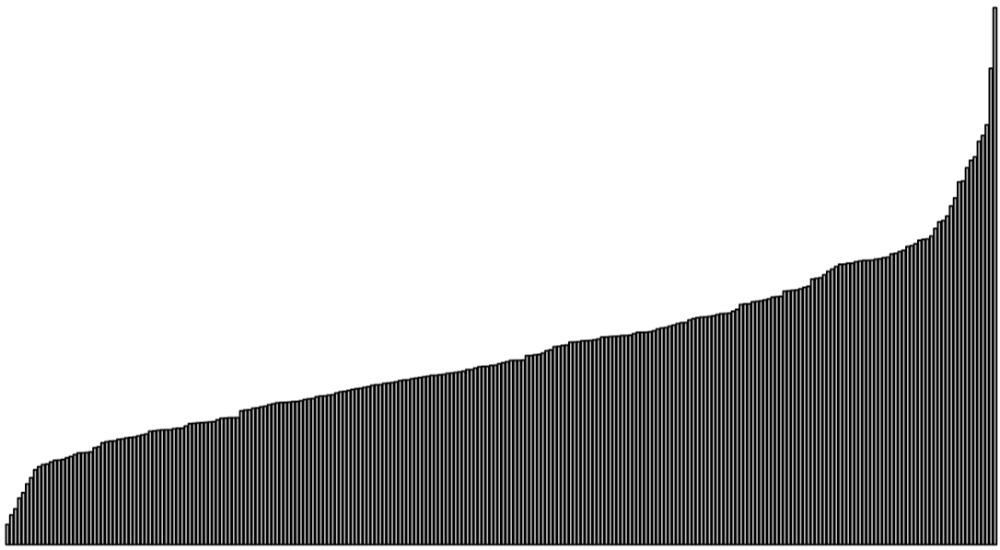

# Advanced Data Analysis Final Project 2021: Where Are You From? Predicting Regionality Using County Demographic Data

+ Team members
	+ Sophie Bair
	+ Amir Idris



**Abstract:** There are many surface-level differences between the major regions of the continental United States: food, accent, fashion, etc. However, are there socioeconomic differences between these regions, ones that can distinguish these regions on a deeper level? Using the county  demographic  information dataset from Applied Linear Statistical Models, 5th edition, by Kutner, Nachtsheim, Neter, and Li., Appendix C2, we attempt to predict which region a county resides using its demographic and economic information. The continental US is split into four regions: Northeast, North Central, South, and West, and we use a polytomous logistic regression model to predict regionality. After selecting the regressors that most significantly differ between regions, the model achieves 66.0% testing accuracy. We believe that this predictive power demonstrates an inequality in these demographics across the regions. 

All code for analysis and modeling can be found [here](docs/main.Rmd). 

```
proj/
├── data/
├── docs/
├── figs/
└── output/
```

